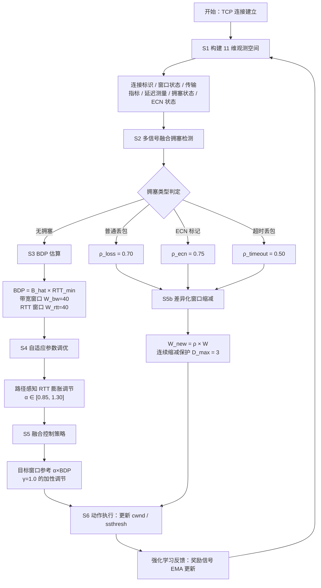
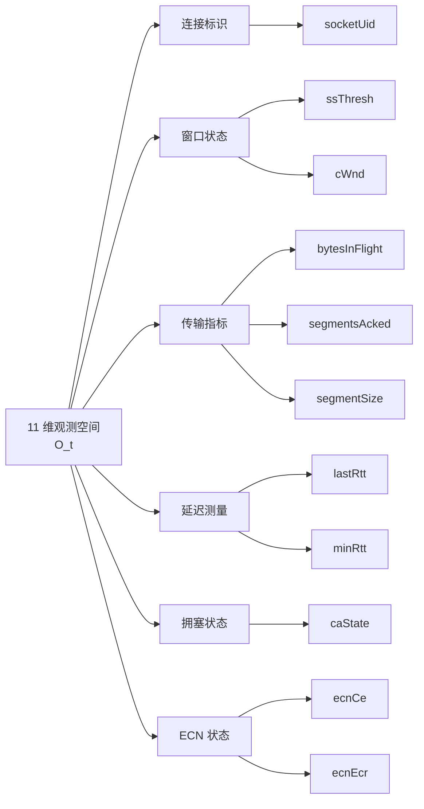
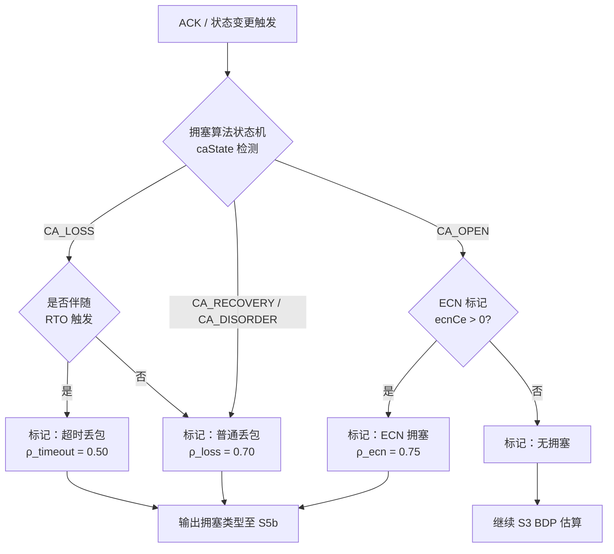
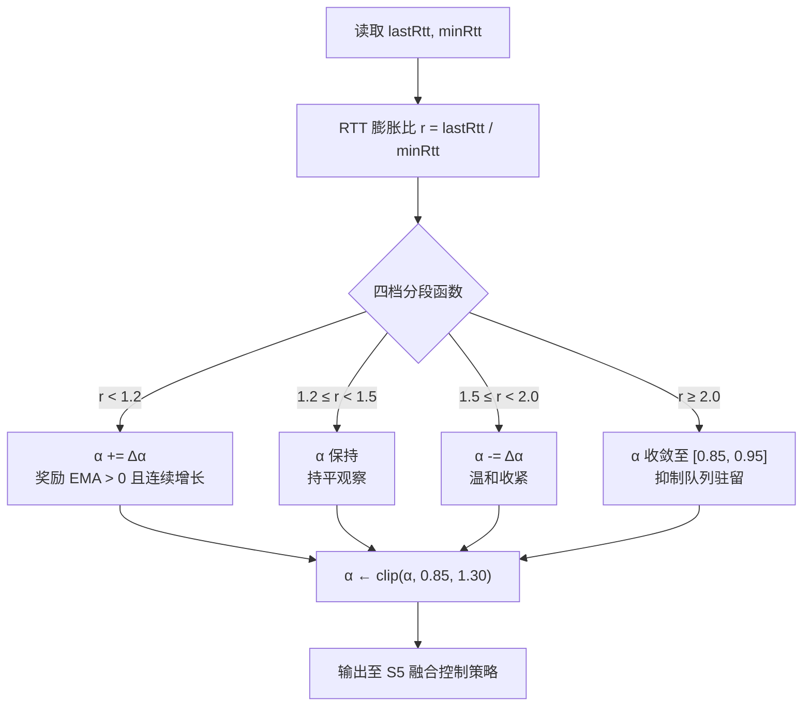
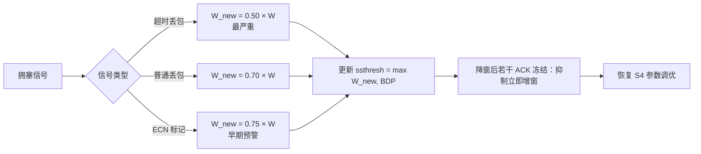
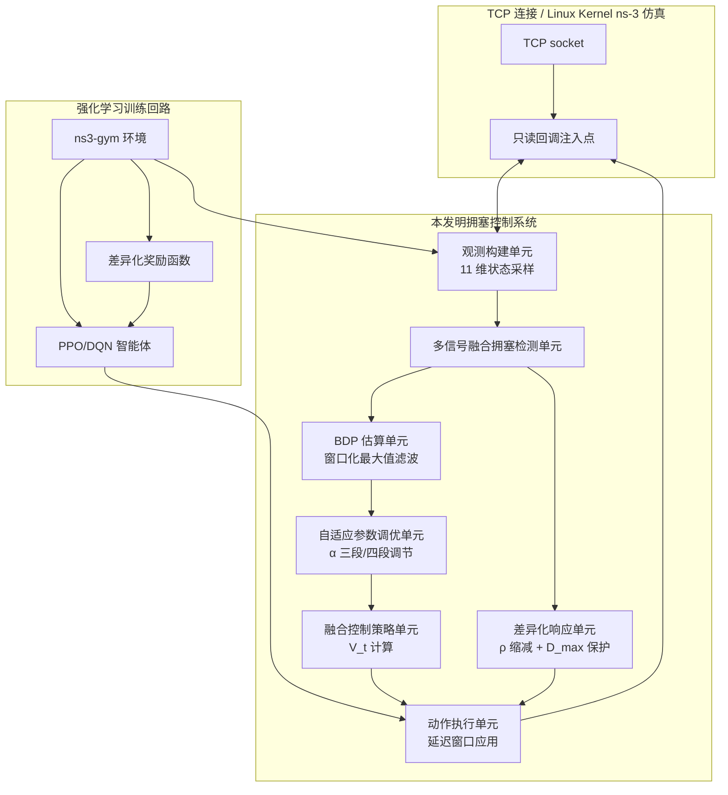

# 发明专利申请

---

## 一种基于强化学习的多信号融合自适应网络拥塞控制方法及系统

---

### 技术领域

[0001] 本发明涉及计算机网络技术领域，特别涉及一种基于强化学习的多信号融合自适应网络拥塞控制方法及系统。

---

### 背景技术

[0002] 随着云计算、移动互联网、人工智能和物联网技术的快速发展，端到端网络传输场景正在从单一固定终端和局域高质量链路，扩展到跨地域远距离传输、蜂窝网络、无线局域网、卫星网络以及手机、笔记本电脑、台式机、边缘设备等多种终端并存的复杂环境。传输控制协议（Transmission Control Protocol，TCP）作为互联网传输层的核心协议，其拥塞控制机制直接影响网络资源利用效率、应用响应延迟和用户服务质量。在远距离路径、高带宽延迟积链路、无线链路抖动以及终端能力差异并存的场景下，传统拥塞控制算法面临更复杂的信号感知和参数适配问题。

[0003] 传统的 TCP 拥塞控制算法主要分为两大类别：基于丢包的拥塞控制算法和基于延迟的拥塞控制算法。这两类算法各有优缺点，但都难以完全适应长距离、多接入和多模态终端并存的现代端到端传输需求。

[0004] 基于丢包的拥塞控制算法（如 TCP NewReno、TCP CUBIC、TCP Reno 等）将数据包丢失作为网络拥塞的主要判断信号。TCP NewReno 采用经典的加性增乘性减（Additive Increase Multiplicative Decrease，AIMD）策略，在无丢包时每个往返时间（Round-Trip Time，RTT）内线性增加一个报文段大小的拥塞窗口，检测到丢包时将窗口减半。TCP CUBIC 是 Linux 操作系统自 2.6.19 版本以来的默认拥塞控制算法，它采用三次函数模型调整窗口大小，通过距离上次拥塞事件的时间来计算窗口增长曲线，在高带宽延迟积（Bandwidth-Delay Product，BDP）网络中具有更快的收敛速度。这类算法的优点是实现简单、鲁棒性强、与现有网络基础设施兼容性好，已被广泛部署于全球互联网中。

[0005] 然而，基于丢包的拥塞控制算法存在以下固有缺陷，限制了其在远距离传输、多接入链路和异构终端环境中的性能表现：

[0006] 第一，丢包是拥塞的滞后信号，具有显著的时间延迟性。网络设备的缓冲区在溢出丢包前已经积累了排队数据，导致传输延迟显著增加。对于交互式应用、移动业务、云端协同和边缘服务等延迟敏感型业务，这种额外的排队延迟会显著影响用户体验。

[0007] 第二，在高带宽延迟积（BDP）网络中，基于丢包算法的收敛速度较慢。远距离传输、卫星链路、跨域广域网和高速无线接入均可能形成较大的带宽延迟积；当拥塞窗口因丢包或超时回退后，传统算法需要较长时间才能恢复到充分利用链路容量的状态。

[0008] 第三，基于丢包算法缺乏对网络拥塞程度的精细感知能力。这类算法只能检测到"有丢包"或"无丢包"两种状态，无法区分轻度拥塞和严重拥塞。因此，无论拥塞程度如何，算法都采用统一的窗口缩减策略（通常是减半），这种做法在轻度拥塞时可能导致不必要的吞吐量下降，而在严重拥塞时又可能响应不够迅速。

[0009] 基于延迟的拥塞控制算法（如 TCP Vegas、TCP BBR 等）通过监测往返时延（RTT）的变化来推断网络拥塞状态，试图在丢包发生前就感知到拥塞并采取措施。TCP Vegas 是最早的基于延迟算法之一，它通过比较期望吞吐量和实际吞吐量来估计网络中的排队数据量，并据此调整发送速率。Google 于 2016 年提出的 BBR 算法是基于延迟算法的重要里程碑，它通过显式估计瓶颈带宽和最小 RTT，以带宽延迟积为目标调整发送速率，理论上能够实现同时最大化吞吐量和最小化延迟的目标。

[0010] 基于延迟的拥塞控制算法具有在丢包发生前感知拥塞的能力，通常能够实现较低的排队延迟。然而，这类算法也存在明显的不足：

[0011] 第一，RTT 测量容易受到多种因素干扰，导致算法稳定性较差。影响 RTT 测量的因素包括：操作系统的调度延迟、网络路径上的抖动、网络拓扑变化、对端主机的处理延迟。在高速网络中，这些干扰因素可能与实际的排队延迟处于同一数量级，使得基于 RTT 的拥塞推断变得不可靠。

[0012] 第二，基于延迟算法在与基于丢包算法共存时存在公平性问题。由于基于延迟算法对拥塞信号更敏感，会在检测到 RTT 增加时提前降低发送速率，而基于丢包算法则继续增加窗口直到发生丢包，因此不同拥塞控制范式在共存场景中可能出现带宽分配失衡。

[0013] 第三，基于延迟算法对于突发流量和路径变化的适应性有限。这类算法的参数调整通常依赖于预设的固定值，难以适应动态变化的网络环境。

[0014] 显式拥塞通知（Explicit Congestion Notification，ECN）是由 IETF 在 RFC 3168 中定义的一种网络层辅助拥塞控制机制。ECN 允许网络设备在检测到队列长度超过预设阈值时，在 IP 报头的 ECN 字段中设置拥塞经历（Congestion Experienced，CE）标记，而不是直接丢弃数据包。接收端收到带有 CE 标记的数据包后，通过 TCP 报头的 ECN-Echo（ECE）标志将拥塞信息反馈给发送端。

[0015] ECN 机制具有以下显著优势：第一，ECN 能够在丢包发生前提供明确的拥塞信号；第二，ECN 避免了因丢包导致的重传开销，提高了网络效率；第三，ECN 信号来自网络设备的显式标记，比推测性的 RTT 测量更加可靠。

[0016] 然而，现有拥塞控制算法对 ECN 的利用还不够充分。大多数传统算法将 ECN 视为等同于丢包的信号进行处理，采用相同的窗口缩减策略。数据中心 TCP（DCTCP）虽然利用 ECN 标记比例进行细粒度调整，但其参数为静态预设，缺乏对不同网络环境的自适应能力。

[0017] 近年来，机器学习特别是强化学习技术的快速发展为网络拥塞控制带来了革命性的新思路。强化学习（Reinforcement Learning，RL）是一种通过与环境交互来学习最优策略的机器学习方法。在强化学习框架中，智能体（Agent）通过观察环境状态、执行动作并获得奖励来不断优化决策策略。

[0018] 将强化学习应用于网络拥塞控制具有以下潜在优势：第一，强化学习能够自适应地学习网络环境特征，无需人工设计复杂的控制规则；第二，强化学习能够综合利用多种拥塞信号进行决策；第三，强化学习能够根据网络条件动态调整控制参数；第四，强化学习具有良好的可扩展性和通用性。

[0019] 然而，现有基于强化学习的拥塞控制方案仍存在以下主要问题：第一，状态空间设计不完善，现有方案通常只使用有限状态参数，未能充分利用 TCP 协议栈提供的丰富状态信息，特别是 ECN 相关状态和拥塞控制事件信息；第二，奖励函数设计不合理，难以平衡吞吐量、延迟、公平性等多个优化目标；第三，缺乏对 ECN 信号的分级利用，未能区分 ECN 触发的拥塞响应和实际丢包触发的拥塞响应；第四，端到端传输场景中终端类型、接入方式、路径 RTT 和链路抖动差异显著，现有方案缺乏对多模态终端和远距离传输环境的自适应能力；第五，多流并发场景下缺乏有效的状态隔离和公平性保障机制。

[0020] 因此，迫切需要一种新的技术方案，能够设计更完善的状态空间以充分利用 TCP 协议栈提供的信息，实现对多种拥塞信号的智能融合和差异化响应，并通过强化学习框架实现控制参数的自适应调优，从而提升远距离传输、多接入链路和异构终端并存环境下的传输稳定性和鲁棒性。

---

### 发明内容

[0021] 本发明的目的在于提供一种基于强化学习的多信号融合自适应网络拥塞控制方法及系统，以解决现有技术中拥塞控制算法对多种拥塞信号利用不充分、缺乏差异化响应机制、参数自适应能力差、复杂端到端场景鲁棒性不足等问题。

[0022] 为实现上述目的，本发明第一方面提供一种基于强化学习的多信号融合自适应网络拥塞控制方法，包括以下步骤：

[0023] S1、构建面向强化学习的多维网络状态观测空间，从 TCP 协议栈的关键回调接口采集包含 11 个参数的完整状态向量，所述参数涵盖连接标识信息、仿真时间信息、窗口状态参数、传输性能指标、延迟测量数据、回调类型标识、拥塞控制状态和显式拥塞通知状态，为强化学习智能体提供全面的环境感知能力；

[0024] S2、基于所述多维状态参数，执行多信号融合拥塞检测，综合分析显式丢包信号和显式拥塞通知信号两类信号源，其中丢包信号通过拥塞算法状态机进一步区分超时丢包和普通丢包两种子类型，判断网络拥塞状态及其类型；

[0025] S3、基于窗口化最大值滤波器估算带宽延迟积，利用长度为 $W_{bw}$ 的滑动窗口内的最大交付速率与全局最小往返时延的乘积计算瓶颈链路的带宽延迟积，为后续窗口调整提供基于速率的参考基准；

[0026] S4、根据拥塞检测结果和历史性能数据，执行强化学习驱动的自适应参数调优，基于 RTT 膨胀比的四档分段函数、奖励信号的指数移动平均值和连续增长趋势三个因子动态调整乘性增加因子 $\alpha$；

[0027] S5、采用基于强化学习的融合控制策略计算目标拥塞窗口大小，在拥塞状态下根据拥塞类型采用差异化窗口保留因子进行乘性缩减，并通过连续缩减保护机制（$D_{max} = 3$）防止窗口死亡螺旋；在非拥塞状态下，慢启动阶段以带宽延迟积为锚点确定目标窗口，拥塞避免阶段以 $\\alpha \\times BDP$ 为目标窗口参考，并根据当前窗口与目标窗口的差距分段拉升、回落或保守增长；

[0028] S6、通过延迟窗口应用机制和强化学习环境接口输出新的慢启动阈值和拥塞窗口大小作为动作，更新 TCP 连接的传输控制参数。

[0029] 进一步地，所述步骤 S1 中，面向强化学习的多维网络状态观测空间包含以下 11 个参数：参数 0 为慢启动阈值；参数 1 为当前拥塞窗口大小；参数 2 为 TCP 报文段大小；参数 3 为已确认报文段数量；参数 4 为在途字节数；参数 5 为最近往返时延；参数 6 为最小往返时延；参数 7 为调用函数类型标识，值为 0 表示慢启动阈值获取回调对应丢包事件，值为 1 表示窗口增加回调；参数 8 为拥塞算法状态，包括开放状态、无序状态、拥塞窗口缩减状态、恢复状态和丢失状态；参数 9 为拥塞算法事件，包括传输开始、窗口重启、CWR 完成、丢失事件、无 CE 标记事件和有 CE 标记事件；参数 10 为显式拥塞通知状态，包括禁用、空闲、收到 CE 标记、发送 ECE、收到 ECE 和发送 CWR 状态。

[0030] 进一步地，所述步骤 S2 中，多信号融合拥塞检测采用两类信号源的分层判定机制：

第一类为显式丢包信号检测：当调用函数类型标识为 0（即慢启动阈值获取回调被触发）时，判定发生丢包类拥塞事件；进一步地，若此时拥塞算法状态为丢失状态（值为 4），则将拥塞子类型判定为超时丢包；否则将拥塞子类型判定为普通丢包；同时递增该流的累计丢包计数器；

第二类为显式拥塞通知信号检测：当显式拥塞通知状态为收到 CE 标记（值为 2）或收到 ECE（值为 4）时，判定发生 ECN 拥塞事件；同时递增该流的累计 ECN 计数器；

当上述两类条件均不满足时，判定当前网络处于非拥塞状态；

所述检测机制不将单次 ECN 回显、拥塞窗口缩减状态、恢复状态和 RTT 膨胀等间接信号作为独立的拥塞触发条件，以避免对瞬态网络扰动的过度响应。

[0031] 进一步地，所述步骤 S3 中，带宽延迟积的估算采用窗口化最大值滤波器方法，具体包括：

交付速率的计算：每当收到确认报文时，根据已确认报文段数量 $n_{ack}$、报文段大小 $S$ 和最近往返时延 $RTT_{last}$ 计算当前交付速率：

$$R_{delivery} = \frac{n_{ack} \times S}{RTT_{last}}$$

仅当 $RTT_{last} > 0$、$n_{ack} > 0$ 且 $S > 0$ 时执行计算；

带宽估算：维护一个长度为 $W_{bw} = 40$ 的滑动窗口队列，存储最近 40 个交付速率样本，取窗口内的最大值作为瓶颈带宽的估计值：

$$\hat{B} = \max_{i \in [1, W_{bw}]} R_{delivery,i}$$

最小 RTT 追踪：维护一个长度为 $W_{rtt} = 40$ 的滑动窗口存储最近 40 个 RTT 采样值，同时追踪全局最小 RTT 值 $RTT_{min}$，更新规则为 $RTT_{min} = \min(RTT_{min}, RTT_{new}, RTT_{min\_ns3})$，其中 $RTT_{min\_ns3}$ 为协议栈提供的最小 RTT 观测值；

带宽延迟积：$BDP = \hat{B} \times RTT_{min}$；当 $BDP \leq 0$ 时，以当前拥塞窗口大小作为保守回退估计值；

吞吐量指数移动平均：$\overline{R}_{t} = 0.9 \times \overline{R}_{t-1} + 0.1 \times R_{delivery}$，首次初始化为第一个有效交付速率值。

[0032] 进一步地，所述步骤 S4 中，强化学习驱动的自适应参数调优对乘性增加因子 $\alpha$ 采用三因子综合调整机制：

因子一，基于 RTT 膨胀比 $r = RTT_{last} / RTT_{min}$ 的路径感知分段调整。根据最小 RTT 的毫秒级数值构造松弛量 $s = 0.3 + 0.15 \times \sqrt{\max(0, RTT_{min,ms} - 1)}$，并设置低、中、高三个动态阈值 $1+s$、$1+2s$ 和 $1+4s$；当 $r$ 小于低阈值时增大乘性增加因子并递增连续增长计数器，其中长 RTT 路径采用较小上调步长；当 $r$ 处于低阈值和中阈值之间时温和增大乘性增加因子；当 $r$ 大于高阈值时减小乘性增加因子并重置连续增长计数器，其中长 RTT 路径采用较大下调步长；

因子二，基于奖励信号指数移动平均值 $\overline{R}_{ema,t} = (1 - \eta) \times \overline{R}_{ema,t-1} + \eta \times r_{t}$ 的阈值触发调整，其中 $\eta = 0.15$；当 $\overline{R}_{ema}$ 大于正向阈值时增大乘性增加因子，当 $\overline{R}_{ema}$ 小于负向阈值时减小乘性增加因子；

因子三，基于连续增长趋势的稳定性奖励：当连续增长计数器超过预设次数时，进一步小幅增大乘性增加因子；

综合更新后，将乘性增加因子箝位于 $[0.85, 1.30]$，初始基准值 $\alpha_{0} = 1.10$。

[0033] 进一步地，所述步骤 S5 中，融合控制策略的拥塞响应采用差异化窗口保留因子：

$$\rho = \begin{cases} 0.70, & \text{普通丢包} \\ 0.75, & \text{ECN 拥塞通知} \\ 0.50, & \text{超时丢包} \end{cases}$$

窗口缩减：$W_{new} = \max(\rho \times W_{old}, W_{min})$，其中 $W_{min} = \max(4 \times MSS, 1)$；

新慢启动阈值根据当前拥塞窗口、带宽延迟积估计和最小窗口边界计算，并保证不低于新的拥塞窗口，以避免拥塞恢复阶段出现过低阈值导致的窗口停滞；

连续缩减保护：每次拥塞响应时连续缩减计数器 $D$ 递增，当 $D > D_{max} = 3$ 时锁定窗口不再缩减；任一显式降窗后，冻结若干后续确认事件中的窗口增长，以便队列完成排空。

[0034] 进一步地，所述步骤 S5 中，非拥塞状态下的窗口增长策略包括：

慢启动阶段（$W < ssthresh$ 且处于慢启动状态）：目标窗口 $W_{target\_ss} = \max(2.0 \times BDP, 10 \times MSS)$；标准增长量 $\Delta W = n_{ack} \times MSS$，当 $W < 0.3 \times BDP$ 时采用双倍增长 $\Delta W = 2 \times n_{ack} \times MSS$；新窗口 $W_{new} = \min(W + \Delta W, W_{target\_ss})$；

拥塞避免阶段：以 $\alpha \times BDP$ 作为目标窗口参考，并以 $\gamma \times MSS$ 作为每次确认事件的加性调节量，其中 $\gamma = 1.0$；当当前窗口低于目标窗口时，按目标差距分段拉升窗口；当当前窗口高于目标窗口时，按超出量逐步回落以排空队列；当当前窗口接近目标窗口时，采用接近 Reno 的保守增长方式；

管道利用率感知加速（$u = bytesInFlight / W$）：当 $u < 0.7$ 时额外增加 $MSS$，当 $u < 0.4$ 时再额外增加 $2 \times MSS$（累计最多 $+3 \times MSS$）；

安全边界：$W_{new} \in [W_{min}, W_{max}]$，其中 $W_{max}$ 根据带宽延迟积和报文段大小设置，用于防止窗口在带宽估计陈旧或队列膨胀时继续失控增长。

[0035] 进一步地，所述方法包括延迟窗口应用机制，用于解决丢包事件回调接口中无法直接修改拥塞窗口的技术限制：在丢包事件触发的慢启动阈值获取回调中，将智能体决策的新拥塞窗口值暂存于缓冲变量中并设置待应用标志位；在后续的窗口增加回调中，检测待应用标志位，若为真则将缓冲的拥塞窗口值应用于 TCP 连接状态并重置标志位。

[0036] 进一步地，所述方法包括强化学习奖励函数的设计：在正常确认事件中，奖励 $r = n_{ack} \times 1.0 - P_{rtt}$，其中 RTT 延迟惩罚 $P_{rtt} = \max((r_{ratio} - 1.5) \times 0.5, 0)$（$r_{ratio} = RTT_{last} / RTT_{min}$），仅当 $r_{ratio} > 2.0$ 时生效；在丢包事件中，检测到 ECN 拥塞标记时 $r = -5.0$，未检测到时 $r = -15.0$。

[0037] 进一步地，所述方法包括每流独立状态管理机制，为每个 TCP 连接以套接字唯一标识符为键通过哈希表维护独立的状态数据结构，包括：长度为 40 的交付速率滑动窗口队列和窗口最大带宽值的带宽估算数据；长度为 40 的 RTT 采样滑动窗口队列和全局最小 RTT 值的 RTT 追踪数据；当前 BDP 估算值；当前乘性增加因子 $\alpha$（初始值 1.10）的自适应参数；降窗后冻结确认事件计数器；连续缩减计数器、连续增长计数器、累计丢包计数和累计 ECN 计数的拥塞计数器；吞吐量指数移动平均值和慢启动阶段标识。

[0038] 本发明第二方面提供一种基于强化学习的多信号融合自适应网络拥塞控制系统，包括：网络仿真模块，用于构建网络拓扑并执行离散事件驱动的网络仿真；拥塞控制环境模块，用于实现强化学习环境接口，从 TCP 协议栈采集状态参数构建观测空间，实现延迟窗口应用机制和 ECN 事件追踪，接收智能体决策并更新 TCP 连接状态；智能决策模块，用于执行多信号融合拥塞检测、BDP 估算、自适应参数调优和融合控制策略计算；进程间通信模块，用于在仿真进程和决策进程之间传递观测数据和控制动作。

[0039] 进一步地，所述进程间通信模块用于支持网络仿真模块与智能决策模块之间的同步交互。仿真进程在 TCP 协议栈关键回调处生成观测向量并发送至智能决策模块；智能决策模块基于所述观测向量输出动作向量；仿真进程接收动作向量后更新慢启动阈值和拥塞窗口。该同步交互方式能够保证强化学习决策与离散事件仿真时序一致，适用于基于 OpenGym 接口的拥塞控制实验和部署验证。

[0040] 进一步地，所述拥塞控制环境模块包括：观测空间定义单元，用于定义 11 维观测空间的形状、数据类型和取值范围；状态采集单元，用于在 TCP 协议栈的 GetSsThresh、IncreaseWindow、PktsAcked、CongestionStateSet 和 CwndEvent 五个回调接口采集状态参数；ECN 事件处理单元，用于在 CwndEvent 回调中追踪 CE 标记计数和 ECN 拥塞检测标志，并在 GetSsThresh 回调中消费和重置该标志；延迟窗口应用单元，用于在只读的 GetSsThresh 回调中缓存拥塞窗口决策，并在后续的 IncreaseWindow 回调中将缓存值应用到 TCP 连接状态中；动作执行单元，用于将控制决策应用于 TCP 连接。

[0041] 本发明第三方面提供一种计算机可读存储介质，其上存储有计算机程序，所述计算机程序被处理器执行时实现上述方法的步骤。

[0042] 本发明第四方面提供一种电子设备，包括处理器和存储器，存储器用于存储计算机程序，处理器执行计算机程序时实现上述方法的步骤。

[0043] 本发明的有益效果包括：第一，本发明提出的多维观测空间将 ECN 状态、拥塞算法状态、拥塞算法事件等协议栈信息纳入强化学习状态表示，提供了更全面的网络状态感知能力；第二，本发明提出的多信号融合拥塞检测方法综合利用丢包信号和 ECN 信号，并通过拥塞算法状态机区分超时丢包和普通丢包，实现了对拥塞类型的精确识别；第三，本发明提出的差异化拥塞响应机制针对普通丢包、ECN 拥塞通知和超时丢包采用不同的窗口保留因子，充分体现了拥塞信号严重程度的差异；第四，本发明提出的连续缩减保护机制和降窗后窗口增长冻结机制能够降低连续拥塞事件导致的窗口过度收缩和快速反弹风险；第五，本发明提出的基于窗口化最大值滤波器的带宽延迟积估算方法能够提高瓶颈链路容量估计的稳定性；第六，本发明提出的自适应参数调优机制能够使控制策略根据 RTT 膨胀、奖励反馈和连续增长趋势进行动态适配；第七，本发明提出的融合控制策略兼具速率控制的效率和窗口控制的稳定性；第八，本发明提出的延迟窗口应用机制解决了只读回调中无法直接修改拥塞窗口的工程难题；第九，本发明提出的每流独立状态管理机制支持多流并发场景下的差异化控制。通过上述技术特征，本发明能够在远距离传输、多接入链路和异构终端并存的网络环境中提升拥塞状态感知能力、降低过度排队和丢包风险，并改善面对突发跨流量和链路条件波动时的传输稳定性与鲁棒性。

---

### 附图说明

[0044] 图 1 是本发明实施例提供的基于强化学习的拥塞控制方法整体流程图；

[0045] 图 2 是本发明实施例提供的 11 维观测空间参数结构图；

[0046] 图 3 是本发明实施例提供的多信号融合拥塞检测流程图；

[0047] 图 4 是本发明实施例提供的带宽延迟积估算原理示意图；

[0048] 图 5 是本发明实施例提供的自适应参数调优流程图；

[0049] 图 6 是本发明实施例提供的融合控制策略计算流程图；

[0050] 图 7 是本发明实施例提供的差异化窗口响应策略示意图；

[0051] 图 8 是本发明实施例提供的连续缩减保护机制示意图；

[0052] 图 9 是本发明实施例提供的拥塞控制系统结构图；

[0053] 图 10 是本发明实施例提供的网络仿真哑铃型拓扑结构图；

[0054] 图 11 是本发明实施例提供的仿真环境与智能决策模块进程间通信结构图；

[0055] 图 12 是本发明实施例提供的强化学习环境与智能体交互时序图；

[0056] 图 13 是本发明实施例提供的延迟窗口应用机制时序图；

[0057] 图 14 是本发明实施例提供的每流状态管理数据结构图；

[0058] 图 15 是本发明实施例提供的奖励函数设计示意图；

[0059] 图 16 是本发明实施例提供的不同网络条件下传输效果定性对比示意图；

[0060] 图 17 是本发明实施例提供的突发跨流量条件下鲁棒性定性对比示意图。

---

### 具体实施方式

[0061] 为使本发明的目的、技术方案和优点更加清楚，下面将结合附图和具体实施例对本发明作进一步详细描述。

#### 实施例一

[0062] 如图 1 所示，本实施例提供一种基于强化学习的多信号融合自适应网络拥塞控制方法，该方法应用于远距离传输、多接入链路和异构终端并存环境下的 TCP 传输优化，包括六个核心步骤。

[0063] 步骤 S1：构建面向强化学习的多维网络状态观测空间。如图 2 所示，观测空间包含 11 个参数，数据类型为 64 位无符号整数，取值范围 $[0, 10^{9}]$。11 个参数分为七类：窗口状态类（参数 0 慢启动阈值、参数 1 拥塞窗口）是拥塞控制核心状态；传输指标类（参数 2 报文段大小、参数 3 已确认段数、参数 4 在途字节）用于性能度量；延迟测量类（参数 5 最近 RTT、参数 6 最小 RTT，微秒）用于 BDP 估算；协议状态类（参数 7 调用函数类型、参数 8 拥塞算法状态、参数 9 拥塞算法事件、参数 10 ECN 状态）提供完整协议栈状态信息。

[0064] 步骤 S2：执行多信号融合拥塞检测。如图 3 所示，综合利用两类信号源：第一类，当调用函数类型（参数 7）为 0 时判定发生丢包，进一步通过拥塞算法状态（参数 8）区分超时丢包（值为 4）和普通丢包；第二类，当 ECN 状态（参数 10）为收到 CE 标记（值为 2）或收到 ECE（值为 4）时判定发生 ECN 拥塞。不将 CA_CWR、CA_RECOVERY 和 RTT 膨胀等间接信号作为独立拥塞触发条件，以实现吞吐量优先。

[0065] 步骤 S3：基于窗口化最大值滤波器估算 BDP。如图 4 所示，交付速率 $R_{delivery} = n_{ack} \times S / RTT_{last}$；带宽估计取最近 40 个样本的最大值 $\hat{B} = \max_{i \in [1,40]} R_{delivery,i}$；最小 RTT 综合滑动窗口（长度 40）内样本和协议栈观测值取全局最小；$BDP = \hat{B} \times RTT_{min}$。当 BDP 尚未获得有效估算时以当前拥塞窗口作为保守回退。

[0066] 步骤 S4：执行自适应参数调优。如图 5 所示，根据三因子动态调整 $\alpha$：因子一，根据最小 RTT 构造路径感知的 RTT 膨胀比动态阈值，在低膨胀状态下增大 $\alpha$，在高膨胀状态下减小 $\alpha$，并对长 RTT 路径采用更稳健的调整步长；因子二，根据奖励信号 EMA 的正向或负向阈值触发小幅增减；因子三，当连续增长计数超过预设次数时给予稳定性奖励。三因子叠加后将 $\alpha$ 箝位于 $[0.85, 1.30]$，基准值为 1.10。

[0067] 步骤 S5：采用融合控制策略计算目标窗口。如图 6、图 7 和图 8 所示：

拥塞分支：差异化窗口保留因子 $\rho$（普通丢包 0.70、ECN 0.75、超时丢包 0.50），$W_{new} = \max(\rho \times W, W_{min})$。新慢启动阈值根据当前拥塞窗口、带宽延迟积估计和最小窗口边界计算，并保证不低于新的拥塞窗口。连续缩减保护：$D > D_{max} = 3$ 时锁定窗口；显式降窗后冻结若干后续确认事件中的窗口增长。

非拥塞分支：慢启动阶段目标 $\max(2.0 \times BDP, 10 \times MSS)$，标准增长 $n_{ack} \times MSS$（$W < 0.3 \times BDP$ 且 RTT 尚未明显膨胀时双倍增长）；拥塞避免阶段以 $\alpha \times BDP$ 为目标窗口参考，以 $1.0 \times MSS$ 为每确认事件的加性调节量，并根据当前窗口与目标窗口的差距分段拉升或回落；安全边界 $W \in [\max(4 \times MSS, 1), \max(10 \times BDP, 200 \times MSS)]$。

[0068] 步骤 S6：输出动作向量 $[ssthresh_{new}, W_{new}]$，更新 TCP 连接状态。在丢包事件中通过延迟窗口应用机制将 $W_{new}$ 暂存，在下一次窗口增加回调中应用。

#### 实施例二

[0069] 如图 9 所示，本实施例提供基于强化学习的拥塞控制系统，包括四个模块。

[0070] 网络仿真模块基于 ns-3 离散事件仿真器构建，实现完整 TCP/IP 协议栈。如图 10 所示，可采用哑铃型拓扑描述多发送端、多接收端与中间瓶颈链路之间的传输关系，并通过可配置的接入链路、瓶颈链路、端到端时延、并发流数量、缓冲区大小和队列管理策略模拟远距离传输、多接入链路和异构终端并存的网络条件。仿真配置用于验证所述方法在不同链路速率、传播时延和突发跨流量条件下的定性效果，不限定本发明的保护范围。

[0071] 如图 11 所示，网络仿真模块与智能决策模块通过 OpenGym 接口和进程间通信机制协同工作。网络仿真模块在离散事件仿真过程中触发 TCP 回调，拥塞控制环境模块将回调状态组织为观测向量并发送至智能决策模块；智能决策模块计算动作向量后返回新的慢启动阈值和拥塞窗口建议；环境模块再通过延迟窗口应用机制将该动作安全地应用到 TCP 连接状态。该结构保持仿真事件时序与智能决策时序一致，适用于强化学习辅助拥塞控制算法的训练、评估和工程验证。

[0072] 如图 12 和图 13 所示，拥塞控制环境模块实现 OpenGym 标准接口，在 TCP 协议栈的 5 个关键回调点采集状态：GetSsThresh 回调在丢包事件触发时采集状态并计算惩罚性奖励（ECN 拥塞 $-5.0$，纯丢包 $-15.0$），同时将智能体决策的新拥塞窗口值缓存至待应用缓冲区；IncreaseWindow 回调首先检查并应用缓存的拥塞窗口，然后采集状态计算正向奖励（吞吐量激励减去 RTT 惩罚）；PktsAcked 回调更新 RTT 和确认段数；CongestionStateSet 回调记录拥塞算法状态变化；CwndEvent 回调追踪 ECN 事件（收到 CA_EVENT_ECN_IS_CE 时设置拥塞检测标志，收到 CA_EVENT_ECN_NO_CE 时清除）。

[0073] 如图 14 所示，智能决策模块为每个 TCP 连接维护独立的每流状态：长度为 40 的交付速率滑动窗口和窗口最大带宽值；长度为 40 的 RTT 采样滑动窗口和全局最小 RTT 值；当前 BDP 估算值；当前自适应参数 $\alpha$（初始值 1.10）；降窗后冻结确认事件计数器；连续缩减计数器、连续增长计数器、累计丢包和 ECN 计数；吞吐量 EMA 和慢启动阶段标识。

[0074] 进程间通信模块采用本地套接字（默认端口 5555）传递序列化的观测向量和动作消息。

#### 实施例三：奖励函数设计

[0075] 如图 15 所示，本实施例说明强化学习奖励函数的设计。奖励函数采用分场景差异化设计：

在正常确认事件中，奖励由吞吐量激励和 RTT 延迟惩罚组成：$r = n_{ack} \times 1.0 - P_{rtt}$。吞吐量奖励与确认段数成正比。RTT 惩罚仅当 $r_{ratio} = RTT_{last} / RTT_{min} > 2.0$ 时生效，$P_{rtt} = (r_{ratio} - 1.5) \times 0.5$，基线从 1.5 倍开始计算以给予排队一定容忍空间，惩罚系数 0.5 温和限制延迟膨胀。

在丢包事件中，根据是否检测到 ECN 拥塞标记（ECN 状态为收到 CE 标记或收到 ECE）施加差异化惩罚：ECN 拥塞 $r = -5.0$，纯丢包 $r = -15.0$。ECN 与丢包惩罚的 1:3 比例体现了"ECN 是预警信号而非灾难"的设计理念。

#### 实施例四：实验验证

#### 实施例四：仿真验证与效果说明

[0076] 为验证本发明方法的有效性和通用性，在 ns-3.40 离散事件网络仿真平台上设计并执行对比仿真实验。实验面向远距离传输、多接入链路、无线接入、移动通信、广域网和卫星链路等典型网络条件，采用一致的拓扑、业务流数量、队列配置和统计口径，对本发明方法与传统拥塞控制方法进行对照。实验数据通过 FlowMonitor 等统计模块采集端到端传输信息，包括吞吐量、传输时延、丢包率和抖动等指标。专利文本仅用于说明本发明方法的技术效果，不限定具体场景参数、实验规模或对比算法名称。

[0076a] 为进一步评估本发明方法在突发性非响应式跨流量条件下的鲁棒性，仿真实验还设置可选 UDP 突发源，使其与 TCP 长流共享瓶颈链路队列，形成纯 TCP 传输与突发跨流量干扰两类对照设置。两类设置保持拓扑、带宽、时延、队列调度与随机种子一致，仅改变突发跨流量是否启用，从而考察本发明方法在非稳定背景流量下对拥塞预警、窗口收敛和吞吐保持能力的影响。

[0077] 仿真场景覆盖短时延高带宽链路、中等带宽接入链路、广域远距离传输链路、无线局域网、蜂窝接入链路和卫星通信链路等网络条件。这些场景能够体现不同瓶颈带宽、往返时延、链路抖动和终端接入能力对拥塞控制策略的影响，适合用于验证本发明方法在远距离传输和异构终端并存环境下的适应性。

[0078] 仿真结果表明，在短时延高带宽场景下，本发明方法能够在保持链路利用率的同时降低排队驻留时间，使平均传输时延相较传统基于丢包触发的控制方法明显降低。其原因在于本发明方法将 ECN 作为早期拥塞预警信号，通过温和但及时的窗口调整抑制队列持续膨胀，而不是等待缓冲区溢出后再进行大幅降窗。

[0079] 在中等带宽接入链路和无线接入场景下，本发明方法能够维持稳定吞吐和较低丢包水平。多信号融合拥塞检测机制能够区分普通丢包、显式拥塞通知和超时丢包等不同拥塞严重程度，避免将链路抖动、随机无线损伤或短时排队统一视为同一类拥塞事件，从而提升异构接入条件下的控制稳定性。

[0080] 在远距离广域网和卫星链路等长 RTT 场景下，本发明方法通过窗口化最大值带宽滤波与最小 RTT 跟踪估算带宽延迟积，并以该估计值约束慢启动阈值和拥塞避免阶段的目标窗口。该机制能够缓解长 RTT 路径中窗口恢复慢、丢包恢复代价高和传统固定参数难以适配的问题，使传输过程在吞吐保持与窗口稳定之间取得更合理的平衡。

[0081] 在突发跨流量干扰场景下，本发明方法仍能够保持较好的鲁棒性。由于带宽估计采用窗口化最大值滤波，短时背景流量扰动不会立即导致瓶颈能力估计塌缩；同时，显式拥塞通知触发的差异化窗口保留因子和降窗后冻结机制可以抑制连续过度增窗，降低突发背景流量造成的二次拥塞风险。

[0082] 上述仿真验证说明，本发明方法的有益效果主要体现为：第一，通过多维状态观测和多信号融合识别提高拥塞状态感知能力；第二，通过基于强化学习反馈的自适应参数调节改善不同 RTT 和不同接入条件下的窗口控制；第三，通过差异化拥塞响应、连续缩减保护和降窗后冻结机制提升传输稳定性与鲁棒性。

[0083] 需要说明的是，本发明方法并不依赖于某一种固定网络域或单一拓扑。即使在网络路径较长、终端类型复杂、接入链路波动较大或存在非响应式突发跨流量的情况下，所述多信号融合感知、BDP 估算和窗口保护机制仍可协同工作，从而减少拥塞控制决策滞后、过度降窗和窗口死亡螺旋等问题。

[0084] 进一步地，本发明方法对适用边界进行了保守处理。当 RTT 膨胀持续升高或连续拥塞事件密集出现时，自适应参数调节和连续缩减保护机制会降低窗口扩张倾向；当降窗刚刚发生时，冻结计数器会暂时抑制后续确认事件中的增长动作。上述设计能够避免在不确定链路条件下过度追求吞吐而引入额外队列驻留。

[0085] 因此，本发明方法可用于远距离传输、多模态终端接入、无线与蜂窝接入、广域网互联、卫星链路和多业务并发传输等场景中的 TCP 拥塞控制优化。其技术效果不以具体实验数值为限定，凡采用本发明所述状态观测、多信号融合、自适应参数调节和窗口保护机制实现的等同替换或组合，均应落入本发明的保护范围。

---

### 权利要求书

1. 一种基于强化学习的多信号融合自适应网络拥塞控制方法，其特征在于，包括以下步骤：

S1、构建面向强化学习的多维网络状态观测空间，从 TCP 协议栈采集包含 11 个参数的状态向量，所述参数涵盖连接标识、时间信息、窗口状态、传输指标、延迟测量、回调类型、拥塞状态和显式拥塞通知状态；

S2、基于所述多维状态参数，执行多信号融合拥塞检测，综合分析丢包信号和显式拥塞通知信号两类信号源，其中丢包信号通过拥塞算法状态机区分超时丢包和普通丢包，判断网络拥塞状态及其类型；

S3、基于窗口化最大值滤波器估算带宽延迟积，利用滑动窗口内的最大交付速率与全局最小往返时延的乘积计算带宽延迟积；

S4、根据拥塞检测结果和历史性能数据，执行强化学习驱动的自适应参数调优，基于 RTT 膨胀比分段函数、奖励信号指数移动平均值和连续增长趋势三个因子动态调整乘性增加因子；

S5、采用融合控制策略计算目标拥塞窗口大小，在拥塞状态下根据拥塞类型采用差异化窗口保留因子进行乘性缩减，并通过连续缩减保护机制防止窗口过度缩减；在非拥塞状态下，将基于带宽延迟积的速率控制与基于当前窗口的保守控制融合，并根据管道利用率进行自适应加速；

S6、通过延迟窗口应用机制输出新的慢启动阈值和拥塞窗口大小，更新 TCP 连接的传输参数。

2. 根据权利要求 1 所述的方法，其特征在于，所述步骤 S2 中，多信号融合拥塞检测采用两类信号源的分层判定：

第一类为显式丢包信号检测：当调用函数类型标识为慢启动阈值获取回调时，判定发生丢包类拥塞；进一步地，若拥塞算法状态为丢失状态，则判定为超时丢包，否则判定为普通丢包；

第二类为显式拥塞通知信号检测：当 ECN 状态为收到 CE 标记或收到 ECE 时，判定发生 ECN 拥塞；

当上述两类条件均不满足时，判定为非拥塞状态；

单次 ECN 回显状态、拥塞窗口缩减状态、恢复状态和 RTT 膨胀不作为独立拥塞触发条件。

3. 根据权利要求 1 所述的方法，其特征在于，所述步骤 S3 中，带宽延迟积估算包括：

交付速率计算：$R_{delivery} = n_{ack} \times S / RTT_{last}$；

带宽估算：维护长度为 $W_{bw}$ 的交付速率滑动窗口，取窗口内最大值作为瓶颈带宽估计；

最小 RTT 追踪：维护长度为 $W_{rtt}$ 的 RTT 采样滑动窗口，同时追踪全局最小 RTT 值；

带宽延迟积为瓶颈带宽估计与全局最小 RTT 的乘积；当带宽延迟积不可用时以当前拥塞窗口作为保守回退。

4. 根据权利要求 1 所述的方法，其特征在于，所述步骤 S4 中，自适应参数调优的三个因子包括：

因子一为基于 RTT 膨胀比的四档分段调整：RTT 膨胀比小于第一阈值时增大乘性增加因子并递增连续增长计数器，处于第一阈值和第二阈值之间时温和增大，处于第二阈值和第三阈值之间时不调整，大于第三阈值时减小并重置连续增长计数器；

因子二为基于奖励信号指数移动平均值的阈值触发调整：EMA 大于正向阈值时增大因子，小于负向阈值时减小因子；

因子三为基于连续增长趋势的稳定性奖励：连续增长计数超过预设次数时增大因子；

三个因子的调整量叠加后，将乘性增加因子箝位于预设的最小值和最大值之间。

5. 根据权利要求 1 所述的方法，其特征在于，所述步骤 S5 中，差异化窗口保留因子包括：

普通丢包对应窗口保留因子 $\rho_{loss}$；

ECN 拥塞通知对应窗口保留因子 $\rho_{ecn}$，其中 $\rho_{ecn} > \rho_{loss}$；

超时丢包对应窗口保留因子 $\rho_{timeout}$，其中 $\rho_{timeout} < \rho_{loss}$；

新慢启动阈值采用 BDP 锚定策略，设置为新窗口与带宽延迟积的较大值。

6. 根据权利要求 1 所述的方法，其特征在于，所述步骤 S5 中，连续缩减保护机制包括：

每次拥塞响应时递增连续缩减计数器并重置连续增长计数器；

当连续缩减计数器超过预设的最大连续缩减次数 $D_{max}$ 时，锁定窗口不再执行缩减操作；

当窗口进入增长阶段时，将连续缩减计数器重置为零。

7. 根据权利要求 1 所述的方法，其特征在于，所述步骤 S5 中，非拥塞状态下的融合控制策略包括：

慢启动阶段：目标窗口为带宽延迟积的预设倍数，当窗口低于带宽延迟积的预设比例时采用双倍增长策略加速带宽探测；

拥塞避免阶段：以乘性增加因子乘以带宽延迟积作为目标窗口参考；当当前窗口低于目标窗口时按目标差距分段拉升，当当前窗口高于目标窗口时按超出量逐步回落，当当前窗口接近目标窗口时按加性增加因子执行保守增长；

管道利用率感知加速：当管道利用率低于第一阈值时额外增加一个段大小，低于第二阈值时累积额外增加三个段大小。

8. 根据权利要求 1 所述的方法，其特征在于，还包括每流独立状态管理机制，为每个 TCP 连接以套接字唯一标识符为键维护独立的状态数据结构，包括：

带宽估算数据：包括交付速率滑动窗口队列和窗口最大带宽值；

RTT 追踪数据：包括 RTT 采样滑动窗口队列和全局最小 RTT 值；

当前带宽延迟积估算值；

自适应参数数据：包括当前乘性增加因子；

拥塞计数器：包括连续缩减计数、连续增长计数、累计丢包计数和累计 ECN 计数；

吞吐量指数移动平均值和慢启动阶段标识。

9. 根据权利要求 1 所述的方法，其特征在于，还包括强化学习奖励函数的设计：

在正常确认事件中，奖励由吞吐量激励和 RTT 延迟惩罚组成，所述 RTT 延迟惩罚仅在 RTT 膨胀比超过预设阈值时生效；

在丢包事件中，根据是否检测到 ECN 拥塞标记施加差异化惩罚，ECN 拥塞的惩罚力度低于纯丢包事件。

10. 根据权利要求 1 所述的方法，其特征在于，所述步骤 S6 中，延迟窗口应用机制包括：

在丢包事件触发的只读回调中，将智能体决策的新拥塞窗口值缓存至待应用缓冲区，并设置待应用标志位；

在后续的窗口增加回调中，检测待应用标志位，若为真则将缓存的拥塞窗口值应用于 TCP 连接状态并重置标志位。

11. 一种基于强化学习的多信号融合自适应网络拥塞控制系统，其特征在于，包括：

网络仿真模块，用于构建网络拓扑并执行离散事件仿真，模拟数据包的传输过程；

拥塞控制环境模块，用于从 TCP 协议栈的多个回调接口采集多维状态参数构建观测空间，实现 ECN 事件追踪和延迟窗口应用机制，并将控制决策应用于 TCP 连接；

智能决策模块，用于执行多信号融合拥塞检测、带宽延迟积估算、自适应参数调优和融合控制策略计算，输出新的慢启动阈值和拥塞窗口大小；

进程间通信模块，用于在网络仿真模块和智能决策模块之间传递观测数据和控制动作。

12. 根据权利要求 11 所述的系统，其特征在于，所述进程间通信模块包括：

观测发送单元，用于将网络仿真模块在 TCP 回调中采集的观测向量发送至智能决策模块；

动作接收单元，用于接收智能决策模块返回的慢启动阈值和拥塞窗口动作；

同步交互单元，用于按照请求-应答模式保持仿真事件与智能决策之间的时序一致；

序列化单元，用于对观测向量和动作向量进行跨进程传输编码。

13. 根据权利要求 11 所述的系统，其特征在于，所述拥塞控制环境模块包括：

观测空间定义单元，用于定义包含 11 个参数的观测空间；

状态采集单元，用于在 TCP 协议栈的 GetSsThresh、IncreaseWindow、PktsAcked、CongestionStateSet 和 CwndEvent 五个回调接口采集状态参数；

ECN 事件处理单元，用于追踪 CE 标记计数和 ECN 拥塞检测标志，并区分 ECN 触发和丢包触发的拥塞响应；

延迟窗口应用单元，用于在只读回调中缓存拥塞窗口决策并在后续可写回调中应用；

动作执行单元，用于将控制决策应用于 TCP 连接。

14. 一种计算机可读存储介质，其上存储有计算机程序，其特征在于，所述计算机程序被处理器执行时实现权利要求 1 至 10 任一项所述方法的步骤。

---

### 说明书摘要

本发明公开了一种基于强化学习的多信号融合自适应网络拥塞控制方法及系统。该方法包括：构建包含 11 个参数的多维网络状态观测空间，涵盖连接标识、窗口状态、传输指标、延迟测量、拥塞状态和 ECN 状态；执行多信号融合拥塞检测，综合利用丢包信号和 ECN 信号进行拥塞类型识别；基于窗口化最大值滤波器估算带宽延迟积；执行自适应参数调优，根据 RTT 膨胀、奖励信号和连续增长趋势动态调整乘性增加因子；采用基于 BDP 的融合控制策略计算目标窗口；针对普通丢包、ECN 拥塞通知和超时丢包采用差异化窗口保留因子，并通过连续缩减保护和降窗后冻结机制防止窗口过度缩减及二次排队驻留；通过延迟窗口应用机制解决只读回调中无法直接写入拥塞窗口的工程限制。该方法能够提升远距离传输、多接入链路和异构终端并存场景下的拥塞状态感知能力、传输稳定性和突发跨流量鲁棒性。

### 摘要附图

图 1 基于强化学习的多信号融合自适应网络拥塞控制方法整体流程图。



---

### 附图源代码（mermaid 渲染）

以下为说明书 §[0044]--[0060] 中关键流程图与结构图的可渲染源代码，与上述附图说明逐项对应。

图 2 11 维观测空间参数结构图。



图 3 多信号融合拥塞检测流程图。



图 5 自适应参数调优流程图。



图 6 融合控制策略计算流程图。

```mermaid
flowchart TD
    A[输入：α, BDP, W_current, MSS] --> B["目标项 T = α × BDP"]
    A --> C["保留项 R = W_current"]
    B --> D["V_base = max T, R"]
    C --> D
    D --> E["加性增量 ΔW = γ × MSS"]
    E --> F["V_t = V_base + ΔW"]
    F --> G{利用率门控<br/>"in_flight / (α×BDP) < 0.70?"}
    G -->|是| H[额外加 1 MSS]
    G -->|否| I[保持 V_t]
    H --> J[输出 cwnd ← V_t]
    I --> J
```

图 7 差异化窗口响应策略示意图。



图 8 连续缩减保护机制示意图。

```mermaid
flowchart TD
    A[拥塞事件 i 触发降窗] --> B[计数器 d_i ← d_(i-1) + 1]
    B --> C{"d_i ≤ D_max（D_max=3）?"}
    C -->|是| D["W_new = ρ × W<br/>正常差异化缩减"]
    C -->|否| E["保护触发：W_new = max W, 0.343 × W_init<br/>避免死亡螺旋"]
    D --> F{下一 RTT 内<br/>是否再次拥塞?}
    E --> F
    F -->|是| A
    F -->|否| G[计数器 d_i ← 0 重置]
    G --> H[继续正常 AIMD]
```

图 9 拥塞控制系统结构图（对应权利要求 11--14）。



上述附图源代码可由任意支持 mermaid 的渲染器（如 mermaid-cli、Typora、VS Code 插件）一键导出为 SVG/PDF，作为说明书附图的最终版式来源。
